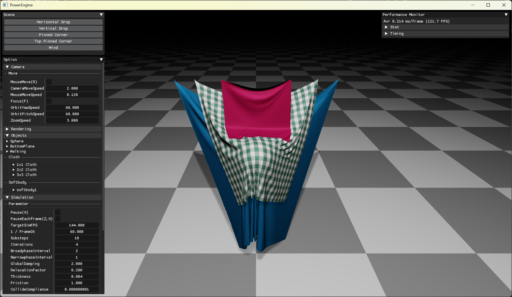
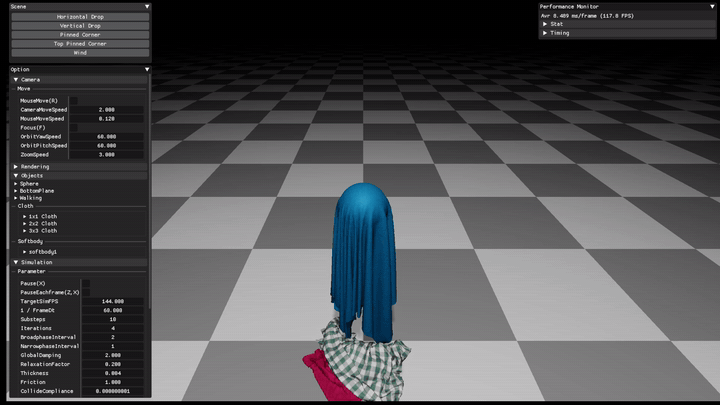
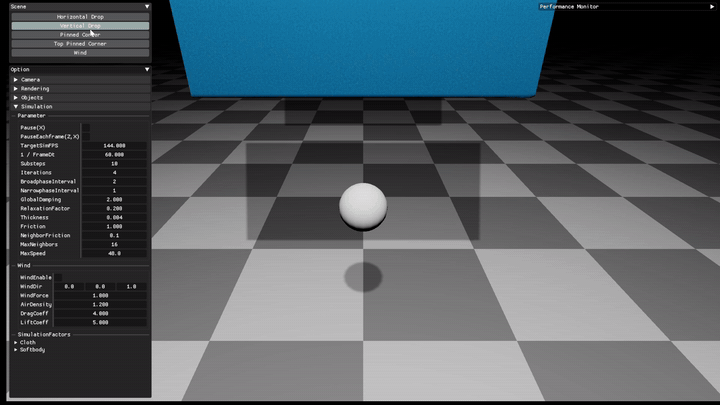
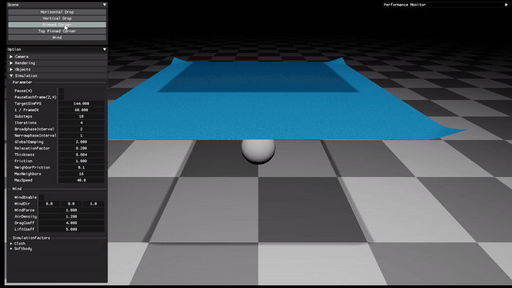
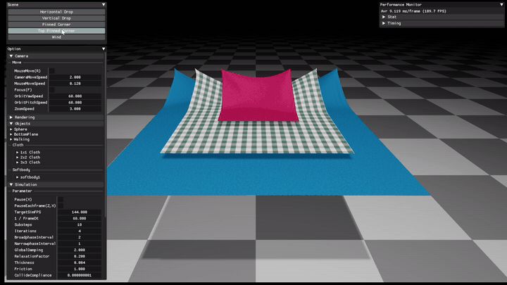
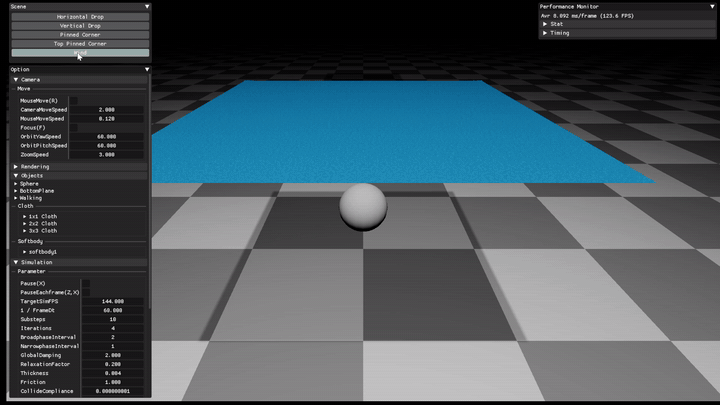

# PowerEngine

> GPU-accelerated particle simulation engine based on **Extended Position Based Dynamics (XPBD)**.  
> Real-time oriented particle systems (cloth / softbody / fluid, etc.) built on a unified XPBD solver.

<p align="center">
  
</p>

---

## Why another XPBD particle engine?

Most real-time particle simulators either:
- focus on a single material model (cloth-only / fluid-only), or
- run on CPU and struggle with performance at higher particle counts, or
- hide critical implementation details behind closed source.

PowerEngine aims to:
- provide a **unified XPBD solver** that can cover multiple particle systems
- keep the architecture **GPU-friendly** for real-time iteration

---

## Demo

<p align="center">
  
  
</p>
<p align="center">
  
  
</p>
<p align="center">
  
</p>

---

## Features

### Core
- [x] Extended position-based dynamics (XPBD) [Macklin+16]
- [x] Small-steps XPBD [Macklin+19]

### Constraints Solve Scheme
- **G**: Gauss–Seidel (sequential, in-place)
- **A**: Parallel accumulation (atomic add; Jacobi-like)
> Note: Atomic accumulation is not strictly deterministic and may converge differently from classic Gauss–Seidel.

### Cloth
- [x] Distance/Stretch (G) [Müller+07]
- [x] Shear (A) [Müller+14]
- [x] Bending (A) [Müller+07]
- [x] Area (A) [Müller+14]
- [x] Self-Collision (A)

### Softbody
- [x] Stretch (A) [Müller+14]
- [x] Volume (A) [Müller+14]

### External Force
- [x] Wind effects [Wilson+14] (used in Disney’s Frozen)

---

## Dependencies

### Third-party libraries
- **GLFW**: window / input
- **Dear ImGui**: debug UI (vendored; built via `add_subdirectory`)
- **KTX-Software** (`KTX::ktx`): KTX/KTX2 texture container support
- **vk_radix_sort**: GPU radix sort (vendored; built via `add_subdirectory`)
- **fmt** (`fmt::fmt-header-only`): logging / formatting

### How dependencies are included
- Vendored in this repository (git submodule):
  - `external/imgui`
  - `external/vk_radix_sort`
- Fetched via package manager (recommended: **vcpkg**):
  - GLFW, KTX-Software, fmt
  
> Note : Check out [THIRD_PARTY_NOTICES.md](./docs/THIRD_PARTY_NOTICES.md)

---

## Quick Start

### Requirements
- Windows
- CMake >= 3.29
- C++ 20
- GPU backend: Vulkan 1.4+ using vulkan_raii
- vcpkg

### Build (CMake)
```bash
git clone https://github.com/steampower33/PowerEngine.git
cd PowerEngine
git submodule update --init --recursive

cmake -S . -B build
cmake --build build --config Release

```
---

## Docs
- [docs/README.md](./docs/README.md)


---

## References
- [docs/references.md](./docs/references.md)

---

## Acknowledgements
- README structure inspired by: [Velvet](https://github.com/vitalight/Velvet/tree/master) (vitalight/Velvet), [elasty](https://github.com/yuki-koyama/elasty?tab=readme-ov-file) (yuki-koyama/elasty)
- The timestamp gui code is referenced from the [Velvet](https://github.com/vitalight/Velvet/tree/master) project.
- Implementation notes referenced: Ten Minute Physics / PBD tutorial notes (Matthias Müller)
- Vulkan learning was done with [Khronos Vulkan](https://docs.vulkan.org/tutorial/latest/00_Introduction.html).