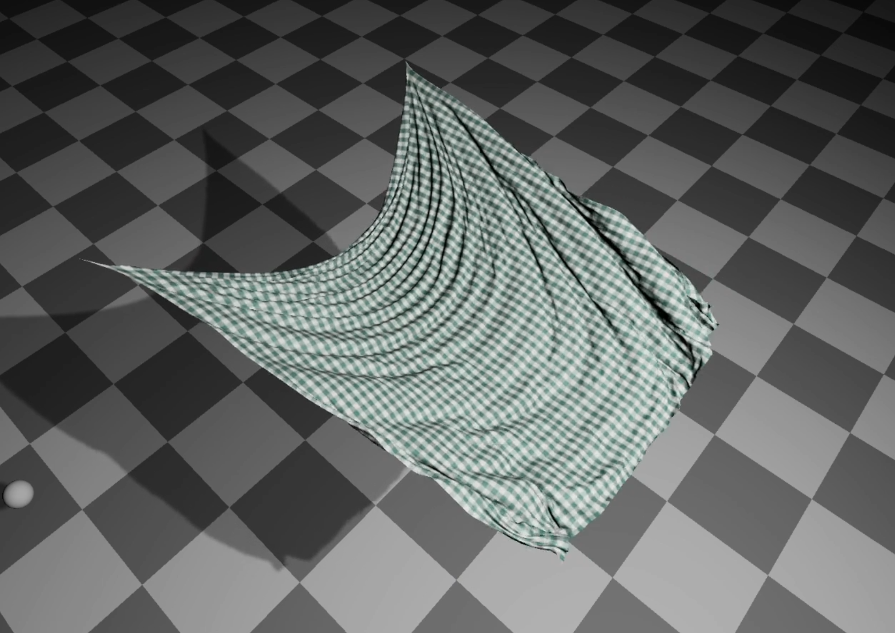

# Vulkan XPBD Cloth Simulation

## 프로젝트 요약

Vulkan Compute Shader 기반으로 구현한 실시간 XPBD Cloth Simulation 프로젝트입니다.

XPBD 기반 Cloth Constraint Solver를 GPU로 병렬화하고,
Spatial Hashing과 GPU Radix Sort를 이용한 Self-Collision Broadphase,
Analytic SDF Collision 및 Vulkan Rendering Pipeline을 구현했습니다.

주요 구현 내용:

- XPBD Cloth Solver
- Multi-Substep Simulation (Small Steps-inspired)
- Stretch / Shear / Bend / Area Constraint
- Self-Collision / Long Range Attachments (LRA)
- Graph Coloring 기반 Gauss-Seidel-style Stretch Solver
- Atomic Add 기반 Jacobi-style Parallel Constraint Solver
- Spatial Hashing / GPU Radix Sort 기반 Neighbor Search
- Sphere / Plane / Capsule Analytic SDF Collision
- Vulkan Compute / Rendering Pipeline 연동

약 **63K Particle / 751K Generated Constraints** 규모에서 시뮬레이션 및 성능 측정을 진행했습니다.

# XPBD-Cloth

> GPU-accelerated cloth simulation based on Extended Position Based Dynamics (XPBD).
> Real-time cloth simulation implemented with Vulkan Compute Shaders.

### Demo Video
[](https://www.youtube.com/watch?v=nu1VZo1UNBs)

---

## Features

### Core

- [x] Extended Position Based Dynamics (XPBD) [Macklin+16]
- [x] Multi-substep XPBD simulation inspired by Small Steps [Macklin+19]

### Constraint Solve Scheme

- **G: Graph-colored Gauss-Seidel-style**
  - Constraints within the same color are processed in parallel.
  - Positions are updated in-place.
  - Colors are dispatched sequentially with synchronization between them.

- **A: Atomic accumulation / Jacobi-style**
  - Constraints calculate position corrections in parallel.
  - Corrections are accumulated using `atomicAdd`.
  - Positions are updated in a separate `ApplyDeltas` pass using averaged and relaxed corrections.

> Note:
>
> - The Stretch solver uses graph coloring to avoid write conflicts while preserving in-place position updates between color passes.
> - Shear, Bend, Area, and Self-Collision use an atomic accumulation path.
> - Floating-point atomic update order is not bitwise deterministic.

### Cloth

- [x] Distance / Stretch — Graph-colored GS-style [Müller+07]
- [x] Shear — Atomic Jacobi-style [Müller+14]
- [x] Bend — Atomic Jacobi-style [Müller+07]
- [x] Area — Atomic Jacobi-style [Müller+14]
- [x] Self-Collision — Atomic Jacobi-style
- [x] Long Range Attachments (LRA) — Per-particle max-distance projection [Kim+12]

### Collision

- [x] Particle Self-Collision
- [x] Sphere Analytic SDF
- [x] Plane Analytic SDF
- [x] Capsule Analytic SDF

### External Force

- [x] Wind Effects [Wilson+14]

---

### Stability Analysis: The "Jittering Cloth" Problem

During development, strong jittering was observed in resting cloth configurations when Stretch and Self-Collision constraints were active.

The instability became especially noticeable as Self-Collision corrections repeatedly interacted with the deformation of the cloth mesh.

To improve the behavior, I added a Shear Constraint based on the dot product between two triangle edges:

```text
C = dot(e1, e2) - restDot
```

The constraint limits changes in the local shape of each triangle by reducing shear deformation.

After enabling the Shear Constraint and tuning the solver parameters, the resting-state jitter was significantly reduced in the tested scenes.

This was an empirical stabilization result from the project rather than a proof of a single numerical root cause. The final solver therefore uses a combination of multiple constraints, substepping, compliance tuning, correction averaging, and relaxation to maintain stable cloth behavior.

### Hybrid Constraint Solver & Multi-Substep XPBD

The cloth solver uses two different GPU constraint solving paths.

#### Graph-colored Stretch Solver

Stretch constraints are preprocessed using vertex-based graph coloring.

Constraints within the same color do not share vertices, so they can be evaluated in parallel without atomic position updates.

Each color is dispatched sequentially, and the predicted positions are updated in-place before the next color pass.

This results in a graph-colored Gauss-Seidel-style solver for Stretch constraints.

#### Atomic Accumulation Solver

Shear, Bend, Area, and Self-Collision constraints use a separate accumulation path.

Each constraint evaluates its position correction in parallel and accumulates the result into per-particle correction buffers using `atomicAdd`.

After the constraint passes are completed, the accumulated corrections are averaged and applied to the predicted positions in a separate `ApplyDeltas` pass.

This path behaves as a Jacobi-style parallel solver.

Because floating-point atomic operations may be executed in different orders, the accumulated results are not guaranteed to be bitwise deterministic.

#### Multi-Substep Simulation

To improve simulation stability, each frame is divided into multiple smaller simulation substeps.

The current default configuration uses:

- 10 substeps per frame
- 4 solver iterations per substep

Each substep performs position prediction, constraint solving, collision processing, and velocity update using the reduced timestep.

This implementation is inspired by the Small Steps approach [Macklin+19], but it also performs multiple solver iterations inside each substep rather than reproducing the original single-iteration-per-substep configuration.

During development, additional stabilization was required for the atomic accumulation path. The final implementation therefore uses correction averaging, relaxation, constraint-specific compliance values, and substepping together rather than relying on a single stabilization technique.

---
## Simulation Loop

```cpp
void UpdateSimulation(float frameDt)
{
    const float h = frameDt / numSubsteps;

    for (uint32_t substep = 0; substep < numSubsteps; ++substep)
    {
        // 1. External Forces & Prediction
        ApplyWind();
        Integrate(h);

        // XPBD lambdas are reset at the beginning of each substep.
        ClearLambdas();

        // 2. Self-Collision Broadphase
        // Neighbor data may be reused between broadphase updates.
        if (selfCollisionEnabled &&
            substep % broadphaseInterval == 0)
        {
            BuildParticleHash();
            GPURadixSort();          // hash key + particle index
            BuildCellRanges();
            BuildNeighborList();
        }

        // 3. Constraint Solver
        for (uint32_t iter = 0; iter < numIterations; ++iter)
        {
            // Stretch:
            // graph-colored Gauss-Seidel-style in-place projection
            if (stretchEnabled)
            {
                for (uint32_t color = 0; color < numColors; ++color)
                {
                    SolveStretchColor(color);
                    BarrierPredictedPosition();
                }
            }

            // Jacobi-style correction accumulation
            if (shearEnabled)
                SolveShear();

            if (bendEnabled)
                SolveBend();

            if (areaEnabled)
                SolveArea();

            if (selfCollisionEnabled &&
                iter % narrowphaseInterval == 0)
            {
                SolveSelfCollision();
            }

            // Shear / Bend / Area / Self-Collision corrections
            // are accumulated using atomic operations.
            BarrierCorrectionBuffers();

            ApplyAveragedDeltasWithRelaxation();
            BarrierPredictedPosition();
        }

        // 4. Post-Solver Constraints

        // Current implementation applies LRA only
        // on the first substep of the frame.
        if (lraEnabled && substep == 0)
            SolveLRA();

        // Analytic SDF collision:
        // Sphere / Plane / Capsule
        CollideAnalyticSDF();

        // 5. Velocity Reconstruction
        UpdateVelocity(h);
    }

    // 6. Rendering Preparation
    ComputeTriangleNormals();
    ComputeVertexNormals();
}
```
---

## Benchmarks

### Test Configuration

| Metric | Value |
|---|---:|
| Cloth Size | 5.0 m × 5.0 m |
| Resolution | 251 × 251 |
| Particles | 63,001 |
| Generated Constraints | ~751,000 |
| GPU | NVIDIA RTX 4060 Laptop GPU |

The generated constraint count includes the cloth constraint data created for Stretch, Shear, Bend, Area, and LRA.

### Measured Performance

In the recorded test configuration, the GPU physics simulation time was approximately:

- **Physics Step: ~7.4 ms**
- **Particles: 63,001**
- **Generated Constraints: ~751K**
- **GPU: RTX 4060 Laptop GPU**

The reported time represents the measured physics workload for the tested scene and configuration.

Because solver cost depends on enabled constraints, substep / iteration counts, self-collision state, and broadphase frequency, the result should be interpreted as a measurement of this project configuration rather than a general throughput limit of the solver.

### Performance Characteristics

Profiling during development showed that constraint solving was one of the major GPU costs as the cloth resolution and solver workload increased.

The current simulation pipeline contains several workload-dependent stages:

- Graph-colored Stretch constraint solving
- Atomic Shear / Bend / Area constraint solving
- Self-Collision constraint solving
- Spatial Hash generation
- GPU Radix Sort
- Cell / Neighbor list construction
- SDF collision
- Velocity and normal updates

The exact cost distribution depends on which constraints and collision features are enabled.

---

## Dependencies

### Vendored / Git Submodules

- Dear ImGui — debug UI
  - `external/imgui`
  - Built as a local static library target
- vulkan_radix_sort — GPU radix sort
  - `external/vk_radix_sort`
  - Included via `add_subdirectory`

### Installed via vcpkg

- GLFW — window / input
- GLM — mathematics
- stb — image utilities
- tinygltf — glTF loading
- KTX-Software (`KTX::ktx`) — KTX / KTX2 texture support
- fmt (`fmt::fmt-header-only`) — logging / formatting

> See `docs/THIRD_PARTY_NOTICES.md` for third-party license information.

---

## Quick Start

### Requirements
- Windows
- CMake >= 3.29
- C++ 20
- Vulkan 1.4-capable GPU / driver
- Vulkan SDK
- Visual Studio 2022 (MSVC) + C++ Desktop workload
- vcpkg (set environment variable `VCPKG_ROOT` to your vcpkg directory, e.g. `C:\vcpkg`)

### 1. Get the Source
First, clone the repository and update submodules.

```bat
git clone https://github.com/steampower33/XPBD-Cloth.git
cd XPBD-Cloth
git submodule update --init --recursive
```

### 2. Build & Run

#### Option A: Visual Studio 2022 (Recommended)
You can use the native CMake support in Visual Studio.

1. Open Visual Studio 2022.
2. Select "Open a local folder" and choose the XPBD-Cloth folder you just cloned.
3. Visual Studio will automatically detect CMakeLists.txt and configure the project.
    Note: If configuration doesn't start, simply open and save CMakeLists.txt to trigger it.
4. Select the startup target (e.g., XPBDCloth.exe) from the toolbar dropdown menu.
5. Press F5 or click the Run (Green Play) button to build and launch.

#### Option B: Command Line

Run from **x64 Native Tools Command Prompt for VS 2022**.

```bat
:: Release
cmake --preset windows-release
cmake --build --preset release
release.bat

:: Debug
cmake --preset windows-debug
cmake --build --preset debug
debug.bat
```

---

## Controls

- `W/A/S/D` — Move camera
- `X` — Pause / Resume
- `Z + X` — Single-frame stepping
- `F` — Focus world origin
- `R` — Toggle mouse camera control
- `LMB` — Rotate object / drag particles
- `RMB` — Move supported objects
- `ESC` — Quit

---

## References

### Papers / Talks
- [Müller+07] Müller et al., *Position Based Dynamics*, 2007. DOI: https://doi.org/10.1016/j.jvcir.2007.01.005
- [Müller+14] Müller et al., *Strain Based Dynamics*, 2014. DOI: https://doi.org/10.2312/sca.20141133
- [Macklin+16] Macklin et al., *XPBD: Position-Based Simulation of Compliant Constrained Dynamics*, 2016. DOI: https://doi.org/10.1145/2994258.2994272
- [Macklin+19] Macklin et al., *Small Steps in Physics Simulation*, 2019. DOI: https://dl.acm.org/doi/10.1145/3309486.3340247
- [Wilson+14] Wilson et al., *Simulating Wind Effects on Cloth and Hair in Disney's Frozen*, SIGGRAPH 2014 Talks. DOI: https://doi.org/10.1145/2614106.2614120
- [Kim+12] Kim et al. *Long range attachments - a method to simulate inextensible clothing in computer games*, 2012. DOI: https://dl.acm.org/doi/10.5555/2422356.2422399

### Slides / Notes
- UCSD CSE169: https://cseweb.ucsd.edu/classes/wi17/cse169-a/slides/CSE169_11.pdf
- Ten Minute Physics (PBD notes): https://matthias-research.github.io/pages/tenMinutePhysics/index.html

### Rendering / API
- OpenPBR: https://github.com/AcademySoftwareFoundation/OpenPBR
- Khronos Vulkan Tutorial: https://docs.vulkan.org/tutorial/latest/00_Introduction.html

---

## Acknowledgements

- README structure and selected implementation patterns were referenced from `Velvet`.
- README formatting was also inspired by `elasty`.
- PBD / XPBD implementation notes referenced Matthias Müller's papers and Ten Minute Physics.
- Vulkan API learning referenced the Khronos Vulkan Tutorial.

---

## Development Journey & Retrospective

### 1. From Vulkan Compute to Cloth Simulation

This project originally started as a Vulkan graphics and compute programming study.

After implementing the basic rendering and compute pipeline, I became interested in GPU-based cloth simulation and began experimenting with particle-based cloth dynamics.

I used XPBD papers and PBD-related technical notes as references and gradually expanded the project from basic cloth constraints to self-collision, GPU neighbor search, and multiple collision constraints.

---

### 2. Iterative Solver Development

The final solver architecture was not designed all at once.

During development, adding Self-Collision and multiple cloth constraints introduced repeated problems such as jittering, excessive corrections, and unstable motion.

The implementation therefore evolved iteratively:

- Added and adjusted Stretch / Shear / Bend / Area constraints
- Introduced graph coloring for the in-place Stretch solver
- Used atomic correction accumulation for parallel multi-particle constraints
- Added correction averaging and relaxation
- Increased simulation substeps and adjusted solver iterations
- Tuned constraint-specific compliance values
- Added LRA to limit excessive global stretching
- Added velocity clamping and damping for large positional corrections

Several of these parameters were tuned empirically while debugging unstable simulation cases rather than derived from a complete numerical analysis.

The current implementation should therefore be viewed as the result of iterative solver stabilization and GPU parallelization experiments.

---

### 3. Self-Collision and GPU Broadphase

Self-Collision became one of the largest implementation challenges in the project.

To avoid testing every particle pair, the final implementation uses:

```text
Predicted Position
        ↓
Spatial Hash
        ↓
GPU Radix Sort
        ↓
Cell Range Construction
        ↓
Neighbor List Construction
        ↓
XPBD Self-Collision
```

The neighbor list is reused between selected substeps to reduce broadphase cost.

This reduces GPU work, but it also means that the cached neighbor information can become stale for fast-moving particles.

The implementation therefore represents a practical real-time trade-off rather than a conservative collision-detection guarantee.

---

### 4. What I Would Change Today

Looking back at the project, I would approach solver development more systematically.

Rather than adding several stabilization techniques while debugging the complete simulation, I would isolate and validate each stage independently:

1. Validate each XPBD constraint on a minimal test scene.
2. Compare Gauss-Seidel and Jacobi-style convergence under controlled conditions.
3. Measure the effect of substep and iteration counts separately.
4. Add Self-Collision only after the structural constraints are validated.
5. Measure broadphase rebuild frequency against missed collision candidates.
6. Record profiler results before and after each optimization or stabilization change.

The current project helped me understand that a simulation that appears visually stable does not necessarily prove that the numerical cause of an instability has been identified.

For that reason, this README distinguishes between implementation details that can be verified directly from the code and stabilization results that were observed empirically.

---

### 5. Current Scope and Limitations

The current implementation includes a real-time GPU XPBD cloth pipeline, but it also has several known limitations.

* Solver parameters are partially based on empirical tuning.
* The implementation uses a hybrid constraint solver rather than a single unified solve scheme.
* The Small Steps paper influenced the substepping structure, but the current implementation uses multiple solver iterations per substep.
* Self-Collision uses discrete particle-based collision detection with a cached neighbor list.
* Sphere / Plane / Capsule collisions use analytic SDFs rather than a volumetric SDF or level-set representation.
* LRA is implemented as a direct maximum-distance projection rather than an XPBD lambda/compliance constraint.
* The project does not provide a formal convergence or error analysis of the complete solver.

These limitations are areas I would investigate more systematically in a future implementation.

