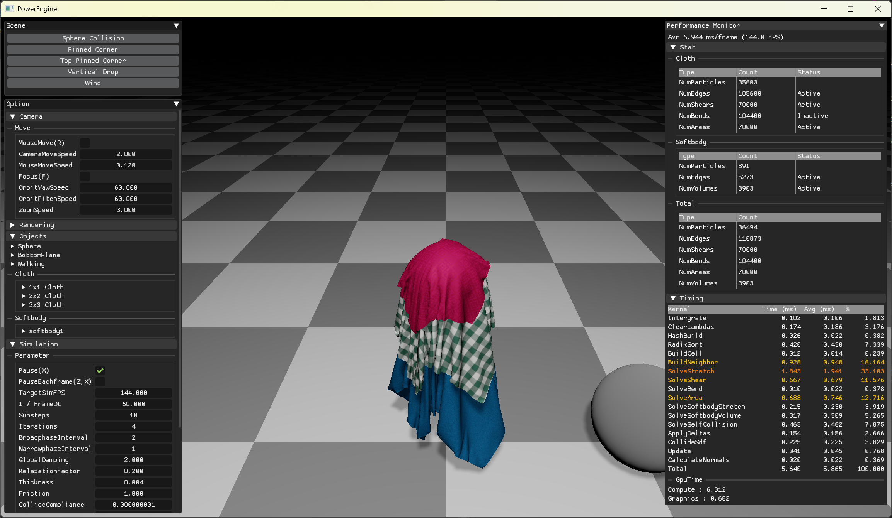

# PowerEngine

> GPU-accelerated particle simulation engine based on **Extended Position Based Dynamics (XPBD)**.  
> Real-time oriented particle systems (cloth / softbody / fluid, etc.) built on a unified XPBD solver.

<p align="center">
  
</p>

---

## Why another XPBD particle engine?

Most real-time particle simulators either:
- focus on a single material model (cloth-only / fluid-only), or
- run on CPU and struggle with performance at higher particle counts, or
- hide critical implementation details behind closed source.

PowerEngine aims to:
- provide a **unified XPBD solver** that can cover multiple particle systems,
- keep the architecture **GPU-friendly** for real-time iteration,
- document “gotchas” and implementation decisions for learning & reproducibility.

---

## Features

### Core
- [x] Extended position-based dynamics (XPBD) [Macklin+16]
- [x] Small-steps XPBD [Macklin+19]

### Constraints Solve Scheme
- **G**: Gauss–Seidel (sequential, in-place)
- **A**: Parallel accumulation (atomic add; Jacobi-like)
> Note: Atomic accumulation is not strictly deterministic and may converge differently from classic Gauss–Seidel.

### Cloth
- [x] Distance/Stretch (G) [Müller+07]
- [x] Shear (A) [Müller+14]
- [x] Bending (A) [Müller+07]
- [x] Area (A) [Müller+14]
- [x] Self-Collision (A)
- [ ] Long-range attachment

### Softbody
- [x] Stretch (A) [Müller+14]
- [x] Volume (A) [Müller+14]

### External Force
- [ ] Wind effects [Wilson+14] (used in Disney’s Frozen)

---

## GPU Compute Pipeline

PowerEngine runs the XPBD simulation entirely on GPU compute shaders.  
The simulation is structured as **Substeps × Iterations**, with additional passes for self-collision and SDF collisions.

### High-level loop
```txt
for each frame:
  Reset scene / Copy colliders
  for substep in [0..substeps):
    Wind (optional)
    Integrate (predict positions)
    Clear lambdas / accumulators
    if substep % broadphase_interval == 0:
      Broadphase: build_hash → radix sort(vk_radix_sort) → fill start/end → build_cell → build_neighbor
    for iter in [0..iterations):
      Solve constraints (stretch uses coloring-GS, others use atomic accumulation)
      Apply accumulated position deltas
    Collide with SDF
    Update velocity
  Recompute normals (tri → vertex)
```

## Rendering

The renderer is primarily for **simulation visualization & debugging** (not a full game renderer).

### Features
- [x] Vulkan rendering backend
- [x] KTX/KTX2 texture loading (KTX::ktx)
- [x] ImGui debug UI
- [ ] GPU skinning / animation (if any)

### Lighting & Materials
- [x] Deferred Shading
- [x] OpenPBR material model (WIP / partial)
  - [x] baseColor / metalness / roughness
  - [x] normal / emissive
  - [ ] clearcoat / transmission (planned)
- [x] IBL (environment lighting)
- [x] Tone mapping / exposure control

### Shadows
- [x] Shadow mapping (spot light)
  - [x] PCF filtering
  - [ ] Cascaded Shadow Maps (CSM)


## Dependencies

### Third-party libraries
- **GLFW**: window / input
- **Dear ImGui**: debug UI (vendored; built via `add_subdirectory`)
- **KTX-Software** (`KTX::ktx`): KTX/KTX2 texture container support
- **vk_radix_sort**: GPU radix sort (vendored; built via `add_subdirectory`)
- **fmt** (`fmt::fmt-header-only`): logging / formatting

### How dependencies are included
- Vendored in this repository (git submodule):
  - `external/imgui`
  - `external/vk_radix_sort`
- Fetched via package manager (recommended: **vcpkg**):
  - GLFW, KTX-Software, fmt

## Quick Start

### Requirements
- Windows
- CMake >= 3.29
- C++ 20
- GPU backend: Vulkan 1.4+ using vulkan_raii
- vcpkg

### Build (CMake)
```bash
git clone https://github.com/steampower33/PowerEngine.git
cd PowerEngine
git submodule update --init --recursive

cmake -S . -B build
cmake --build build --config Release

---------------continue scripting
```

## References
- [Müller+07] Müller et al., *Position Based Dynamics*, 2007. DOI: https://doi.org/10.1016/j.jvcir.2007.01.005
- [Müller+14] Müller et al., *Strain Based Dynamics*, 2014. DOI: https://doi.org/10.2312/sca.20141133
- [Macklin+16] Macklin et al., *XPBD: Position-Based Simulation of Compliant Constrained Dynamics*, 2016. DOI: https://doi.org/10.1145/2994258.2994272
- [Macklin+19] Macklin et al., *Small Steps in Physics Simulation*, 2019. DOI: https://dl.acm.org/doi/10.1145/3309486.3340247
- [Wilson+14] (used in Disney’s Frozen) DOI: https://doi.org/10.1145/2614106.2614120
- [OpenPBR](https://github.com/AcademySoftwareFoundation/OpenPBR?utm_source=chatgpt.com) 

## Acknowledgements
- README structure inspired by: [Velvet](https://github.com/vitalight/Velvet/tree/master) (vitalight/Velvet), [elasty](https://github.com/yuki-koyama/elasty?tab=readme-ov-file) (yuki-koyama/elasty)
- The timestep gui code is referenced from the [Velvet](https://github.com/vitalight/Velvet/tree/master) project.
- Implementation notes referenced: Ten Minute Physics / PBD tutorial notes (Matthias Müller)
- Vulkan learning was done with [Khronos Vulkan](https://docs.vulkan.org/tutorial/latest/00_Introduction.html).