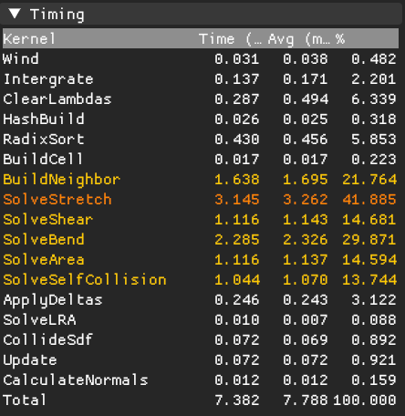

# PhysixStudio

> GPU-accelerated particle simulation engine based on **Extended Position Based Dynamics (XPBD)**.  
> Real-time oriented cloth particle system built on a unified XPBD solver.

### Demo Video
[](https://www.youtube.com/watch?v=ljOphc_zVS8)

---

## Features

### Core
- [x] Extended position-based dynamics (XPBD) [Macklin+16]
- [x] Small-steps XPBD [Macklin+19]

### Constraints Solve Scheme
- **G**: Gauss–Seidel (sequential, in-place projection)
- **A**: Parallel accumulation (atomic add + apply; Jacobi-style)

> Note:
> - The accumulation path is **Jacobi-style** (constraints write to accumulators, then positions are updated in a separate pass).
> - Due to atomic update order, results are **not bitwise deterministic** and may converge differently from classic GS/Jacobi.

### Cloth
- [x] Distance/Stretch (G) [Müller+07]
- [x] Shear (A) [Müller+14]
- [x] Bend (A) [Müller+07]
- [x] Area (A) [Müller+14]
- [x] Self-Collision (A)
- [x] LRA(Long Range Attachments) (per-particle sequential projection; GS-like) [Kim+12]

### External Force
- [x] Wind effects [Wilson+14] (used in Disney’s Frozen)

---
## Technical Deep Dive

### Stability Analysis: The "Jittering Cloth" Problem
During the development of the physics solver, a severe instability issue was observed where the cloth would vibrate uncontrollably even in a resting state. This occurred specifically when only Distance (Stretch) and Self-Collision constraints were active.

Problem: Without shear resistance, a grid-based cloth mesh suffers from structural instability (Zero-Energy Modes). A quad element can easily distort (shear) without violating the edge length constraints. This lack of rigidity caused a conflict between the Self-Collision (pushing particles apart) and Stretch (pulling them together), leading to an infinite feedback loop of jitter.

Solution: I implemented Shear Constraints using a dot-product based approach (preserving the angle between edges) rather than simple diagonal springs.

Result: This effectively locks the internal angles of the triangle mesh. The system gained significant structural rigidity, and the jittering was completely eliminated. This proved that shear constraints are essential not just for material fidelity but for the numerical stability of the solver.

### Parallel Constraint Solving & Small-steps XPBD
To maximize GPU parallelism using Compute Shaders, I adopted a Jacobi-style accumulation scheme.

Parallelism: Instead of sequentially projecting positions (Gauss-Seidel), which is hard to parallelize, each constraint calculates a position correction vector and adds it to a global accumulator using atomicAdd.

Trade-off: Jacobi solvers often converge slower and can be unstable with high stiffness compared to Gauss-Seidel. Additionally, floating-point atomic operations introduce slight non-determinism.

Mitigation: To ensure stability and robust convergence under these conditions, I utilized Small-steps XPBD [Macklin+19]. By dividing the frame into multiple substeps (e.g., 10 substeps), the solver can handle extremely stiff constraints and collisions without exploding, compensating for the inherent instability of the parallel Jacobi approach.

---

## Simulation Loop

```cpp
void UpdateSimulation(float dt) 
{
    float h = dt / num_substeps;

    for (int substep = 0; substep < num_substeps; ++substep) 
    {
        // 1. Prediction & External Forces
        ApplyWind();
        Integrate(h);

        // 2. Broadphase (Spatial Hashing)
        if (substep % broadphase_interval == 0) {
            BuildHashGrid();
            SortParticles();
            IdentifyNeighbors();
        }

        // 3. XPBD Solver Loop
        for (int iter = 0; iter < num_iterations; ++iter) 
        {
            // Accumulate Constraints (AtomicAdd)
            SolveStretch();
            SolveShear();  // Dot-product based
            SolveBend();   // Dihedral angle
            SolveArea();
            
            if (iter % narrowphase_interval == 0)
                SolveSelfCollision();

            // Apply averaged corrections to x_pred
            ApplyDeltas(); 
        }

        // 4. Post-Solver Steps
        SolveLRA();   // Long Range Attachments
        CollideSDF(); // Static Collision (Spheres, Capsules)
        
        UpdateVelocity(h);
    }

    // 5. Rendering Prep
    ComputeNormals();
}
```
---

## Benchmarks

### Stat
| Metric | Value |
| :--- | :--- |
| **Grid Size** | 5.0m x 5.0m |
| **Resolution** | 63,001 Particles (251 x 251) |
| **Total Constraints** | **~751,000** (Stretch/Shear/Bend/Area/LRA) |
| **Performance Environment** | RTX 4060 Laptop GPU |

### Performance


Running on an **RTX 4060 Laptop GPU**, the simulation achieves stable real-time performance with **63,001 particles**.

- **Average Physics Step:** ~7.4 ms
- **Theoretical Max FPS:** ~135 FPS (Physics Only)
- **Bottleneck:** The constraint solving stages (`SolveStretch`, `SolveBend`) take up the majority of the computation time (~50%), which is typical for high-stiffness XPBD simulations.


---

## Dependencies

### Third-party libraries
- **GLFW**: window / input
- **Dear ImGui**: debug UI (vendored; built via `add_subdirectory`)
- **KTX-Software** (`KTX::ktx`): KTX/KTX2 texture container support
- **vk_radix_sort**: GPU radix sort (vendored; built via `add_subdirectory`)
- **fmt** (`fmt::fmt-header-only`): logging / formatting

### How dependencies are included
- Vendored in this repository (git submodule):
  - `external/imgui`
  - `external/vk_radix_sort`
- Fetched via package manager (recommended: **vcpkg**):
  - GLFW, KTX-Software, fmt
  
> Note : Check out [THIRD_PARTY_NOTICES.md](./docs/THIRD_PARTY_NOTICES.md)

---

## Quick Start

### Requirements
- Windows
- CMake >= 3.29
- C++ 20
- GPU backend: Vulkan 1.4+ (LunarG SDK)
- Visual Studio 2022 (MSVC) + C++ Desktop workload
- vcpkg (set environment variable `VCPKG_ROOT` to your vcpkg directory, e.g. `C:\vcpkg`)

### 1. Get the Source
First, clone the repository and update submodules.

```bat
git clone https://github.com/steampower33/PhysixStudio.git
cd PhysixStudio
git submodule update --init --recursive
```

### 2. Build & Run

#### Option A: Visual Studio 2022 (Recommended)
You can use the native CMake support in Visual Studio.

1. Open Visual Studio 2022.
2. Select "Open a local folder" and choose the PhysixStudio folder you just cloned.
3. Visual Studio will automatically detect CMakeLists.txt and configure the project.
    Note: If configuration doesn't start, simply open and save CMakeLists.txt to trigger it.
4. Select the startup target (e.g., PhysixStudio.exe) from the toolbar dropdown menu.
5. Press F5 or click the Run (Green Play) button to build and launch.

#### Option B: Command Line (CLI)
Run from x64 Native Tools Command Prompt for VS 2022.

```
:: Release Build
cmake --preset windows-release
cmake --build --preset release
release.bat

:: Debug Build
cmake --preset windows-debug
cmake --build --preset debug
debug.bat
```

---

## 🛠️ How to Add New Cloth
Currently, the cloth scene setup is hardcoded in the C++ source. To add a new cloth object or modify existing ones, follow these steps:

1. Open `src/cloth_particle_manager.cpp`.
2. Locate the **constructor** `ClothParticleManager::ClothParticleManager`.
3. Inside the constructor, you will find a code block creating a `Cloth` object. You can duplicate this block to add multiple cloth instances.

### Example Code
```cpp
// Inside ClothParticleManager::ClothParticleManager(...)

{
    Cloth cloth{}; // Create new instance

    // 1. Physics Properties
    cloth.name = "MyNewCloth";
    cloth.spacing = 0.05f;           // Grid spacing (resolution)
    cloth.gsm = 0.2f;                // Weight (Grams per Square Meter)
    cloth.cloth_size = glm::vec2(5.0f, 5.0f); // Width x Height

    // 2. Initial Transform
    cloth.origin = glm::vec3(2.0f, 5.0f, 0.0f); // Position
    cloth.angle_deg = 90.0f;                    // Rotation angle
    cloth.axis = glm::vec3(1, 0, 0);            // Rotation axis

    // 3. Rendering Material
    std::string base = "assets/fabric/denim";   // Texture path
    cloth.ubo_data.albedo_idx = textureManager.CreateTexture(base, "diff", false, true);
    // ... set other texture maps (normal, arm) ...

    // 4. Register to Solver (IMPORTANT)
    SetPlaneCloth(cloth); 
}
```

---

## Controls

* **W/A/S/D**: Move the camera
* **X**: Pause/Resume simulation
* **Z + X**: After pressing **Z**, pressing **X** steps the simulation **one frame at a time** (frame stepping)
* **F**: Focus the camera on the world origin
* **R**: Toggle mouse-driven camera control (enable/disable view rotation by mouse)
* **Right Mouse Button (RMB)**: Move objects *(particle-based objects are not supported yet)*
* **Left Mouse Button (LMB)**: Rotate objects
* **LMB (Particle interaction)**: Drag particles with the mouse
* **ESC**: Quit the application

---

## References

### Papers / Talks
- [Müller+07] Müller et al., *Position Based Dynamics*, 2007. DOI: https://doi.org/10.1016/j.jvcir.2007.01.005
- [Müller+14] Müller et al., *Strain Based Dynamics*, 2014. DOI: https://doi.org/10.2312/sca.20141133
- [Macklin+16] Macklin et al., *XPBD: Position-Based Simulation of Compliant Constrained Dynamics*, 2016. DOI: https://doi.org/10.1145/2994258.2994272
- [Macklin+19] Macklin et al., *Small Steps in Physics Simulation*, 2019. DOI: https://dl.acm.org/doi/10.1145/3309486.3340247
- [Wilson+14] Wilson et al., *Simulating Wind Effects on Cloth and Hair in Disney's Frozen*, SIGGRAPH 2014 Talks. DOI: https://doi.org/10.1145/2614106.2614120
- [Kim+12] Kim et al. *Long range attachments - a method to simulate inextensible clothing in computer games*, 2012. DOI: https://dl.acm.org/doi/10.5555/2422356.2422399

### Slides / Notes
- UCSD CSE169: https://cseweb.ucsd.edu/classes/wi17/cse169-a/slides/CSE169_11.pdf
- Ten Minute Physics (PBD notes): https://matthias-research.github.io/pages/tenMinutePhysics/index.html

### Rendering / API
- OpenPBR: https://github.com/AcademySoftwareFoundation/OpenPBR
- Khronos Vulkan Tutorial: https://docs.vulkan.org/tutorial/latest/00_Introduction.html

---

## Acknowledgements
- README structure inspired by: [Velvet](https://github.com/vitalight/Velvet/tree/master) (vitalight/Velvet), [elasty](https://github.com/yuki-koyama/elasty?tab=readme-ov-file) (yuki-koyama/elasty)
- The timestamp gui code is referenced from the [Velvet](https://github.com/vitalight/Velvet/tree/master) project.
- Implementation notes referenced: Ten Minute Physics / PBD tutorial notes (Matthias Müller)
- Vulkan learning was done with [Khronos Vulkan](https://docs.vulkan.org/tutorial/latest/00_Introduction.html).

---

## 🔮 What's Next?
Recently, I watched a video of a robot folding clothes, and it gave me a lot of inspiration.

It made me want to implement simulations where a robot interacts with cloth—like hanging wet laundry on a drying rack or ironing clothes. I plan to start a robotics-related project soon to try and implement these interactions myself.

---

## 📜 Development Journey & Retrospective

**1. From Vulkan to Physics**
This project began as a deep dive into **Vulkan**. Having previous experience with DirectX 11 and 12, I started with the Khronos Vulkan Tutorial and quickly adapted to the API. 
While exploring Sascha Willems' Vulkan examples, I was inspired by the mass-spring cloth demo. My curiosity led me to implement a basic mass-spring system, but I soon craved more stability and realism. This led me to discover **XPBD (Extended Position Based Dynamics)**.

**2. Diving into XPBD**
I studied Matthias Müller's papers and *Ten Minute Physics* articles to build the foundation. I realized that constraints are not just individual rules but a complex web of interactions designed to resolve conflicts. Implementing these papers one by one and analyzing the interplay between constraints was the core of this project.

**3. The Challenge: Self-Collision**
A significant portion of development time was dedicated to stabilizing **Self-Collision**.
I researched alternative approaches like **AVBD (Affine Body Dynamics)** and **Stable Cosserat Rods**, recognizing their potential for better performance and stability. 
However, since they represent a fundamentally different class of solvers, integrating them would require a complete architectural overhaul. I decided to treat this project as a dedicated study of XPBD and reserve those techniques for future projects.

**4. Conclusion**
Through this journey, I realized that to fundamentally solve self-collision (beyond heuristics), I need to delve into battle-tested techniques like **Baraff-Witkin** or **Geometric Contact**. My next step is to study these foundational papers to overcome the limitations of my current implementation.

---

## 💬 Contact & Feedback
This project reflects my deep interest in Physics Simulation and Graphics Programming. I welcome any feedback, suggestions, or discussions about the code!

- **Email:** devhopper100@gmail.com
- **LinkedIn:** https://www.linkedin.com/in/seungmin-lee-96b3aa231/
- **Youtube:** https://www.youtube.com/@Dev.Hopper

---
