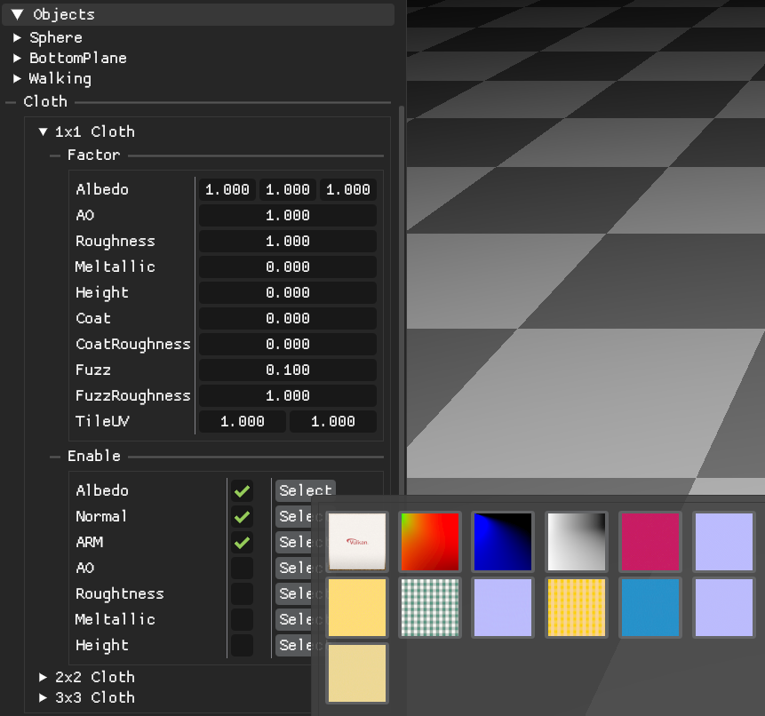

---

## XPBD
- **XPBD (Extended Position-Based Dynamics)** is a constraint-based simulation method that enforces constraints directly on particle positions.
- Unlike classic PBD, XPBD introduces **compliance (α)** to control stiffness in a time-step–robust way, making results less sensitive to the chosen `dt`.
- Each constraint is solved via XPBD using **first-order constraint gradients** `∇C` to compute `Δλ` and apply mass-weighted position corrections.

---

## Simulation

PowerEngine runs the XPBD simulation entirely on GPU compute shaders.  
The simulation is structured as **Substeps × Iterations**, with additional passes for self-collision and SDF-based collisions.

### High-level loop
```txt
for each frame:
  Reset scene / Copy colliders
  for substep in [0..substeps):
    Wind
    Integrate (predict positions)
    Clear lambdas / accumulators
    if substep % broadphase_interval == 0:
      Broadphase: build_hash → radix sort(vk_radix_sort) → build cell ranges(start/end) → build neighbor list
    for iter in [0..iterations):
      Solve constraints (stretch uses coloring-GS, others use atomic accumulation)
      Solve Self Collision
      Apply accumulated position deltas
      Clear accumulators (per-iteration)
    Solve LRA (Long-Range Attachments)
    Collide with SDF
    Update velocity
  Recompute normals (tri → vertex)
```

### Implementation Details

- Wind

  - Implements a lift/drag force model inspired by the SIGGRAPH 2014 talk used in Disney's *Frozen* ([Winson+14], see `docs/references.md`).
  - Samples a wind **velocity field** `u_air(x,t)` and computes relative velocity `rel = u_air - u_tri` per triangle.
  - Accumulates per-vertex **delta velocity (Δv)** using atomic operations.

- Integrate (Prediction)

  - Applies user interaction (mouse pick / drag) as an external input (force/impulse).
  - Applies accumulated Δv from the wind pass.
  - Computes predicted positions `xp = x + dt * v`.

- Clear lambdas / accumulators

  - Resets per-constraint XPBD lambdas (λ) for the current substep.
  - Clears per-vertex accumulators used for parallel constraint solving (e.g., `delta_x/y/z` and `delta_count`).

- Broadphase (Self-collision neighbor search)

  - Builds a spatial hash to find nearby particles.
  - Uses radix sort from `vk_radix_sort` to sort keys and build cell ranges.
  - Generates a neighbor list for narrowphase / constraint evaluation.

- Solve constraints
  - Stretch (Edge)
    - Enforces distance constraints on mesh edges.
    - Uses XPBD damping term β (in addition to compliance α).

  - Shear
    - Enforces shear behavior on cloth quads (implementation-dependent: angle/diagonal-based).

  - Bend
    - Enforces dihedral bending angle constraints between adjacent triangles.

  - Area
    - Enforces triangle area constraints.

  - Self Collision
    - Candidate pairs are obtained from the broadphase **neighbor list** (`neighbors`), built from the spatial hash grid.
    
    - The constraint is a **particle–particle distance inequality** (non-penetration):
      - Penetration when `dist < r` (`r = collision_radius`)
      - Constraint value `C = dist - r` and we solve only when `C < 0`
      - XPBD compliance is included via `α̃ = compliance / dt²` in the denominator to reduce timestep sensitivity.
      - Because this is an inequality constraint, the Lagrange multiplier is clamped to `λ ≥ 0` and stored per neighbor-slot in `neighbor_lambdas[idx]`.

    - Friction is implemented as a **PBD/XPBD-style tangential displacement clamp** (heuristic), not a full Coulomb cone solve:
      - We form a relative displacement proxy using previous positions:
        `rel_disp = (xp_i - x_i) - (xp_j - x_j)`
      - Using the normal correction magnitude as a proxy `dn ≈ |(wi+wj) * Δλ|`, we limit tangential motion by:
        `|t| ≤ μ * dn`, where `μ = neighbor_friction`.
      - This is primarily for stability/visual plausibility rather than physically exact friction.

    - For parallel GPU solving, corrections are **atomically accumulated** into `delta_x/y/z` and `delta_count` rather than writing directly to `xp`.
      The accumulated deltas are applied later in the “Apply accumulated position deltas” pass.

  - LRA (Long-Range Attachments)
    - Adds long-range constraints that prevent unrealistic global stretching under gravity and fast motion.
    - Implemented as a post-iteration pass (after all local constraints per substep), before SDF collision.
    - Each particle stores `K` attachment anchors and rest distances in SSBO (`lra_ids`, `lra_rests`).
    - Solve step:
      - For each attachment `(anchor a, radius r)`, enforce `|x_i - x_a| ≤ r` by projecting back onto a sphere when violated.
      - Uses `lra_stiffness` to blend towards the projected position (artist-friendly control).
    - Controlled stretchiness:
      - The stored rest radius can be inflated by a **slack** factor (currently `+10%`, i.e. `r *= 1.1`).
      -Together, `slack` and `lra_stiffness` control how strongly LRA “pulls back” the cloth and how much extra stretch is allowed.
    
    > Note: The original LRA paper describes accumulating per-attachment displacements and applying their average per particle.

    > This project currently applies attachments sequentially with a stiffness blend, which is simpler and works well in practice.

    > LRA rest radii are precomputed on CPU by running **Dijkstra** over the cloth graph (edges weighted by rest edge length) from each anchor to all vertices, then selecting the `K` closest anchors per vertex.

    > On GPU, LRA is evaluated as a lightweight projection-only pass with no lambdas (pure positional correction).

- Apply accumulated position deltas
  - Applies atomically accumulated corrections to predicted positions.
  - Deltas are averaged (divided by `delta_count`).
  - `relaxation_factor` is an optional *under-relaxation* step size (default 1.0).
    Values < 1.0 reduce correction magnitude and can improve stability, but slow convergence
    and make constraints/collisions appear weaker (may require more iterations).

- Collide with SDF
  - Applies SDF-based collisions for primitive colliders (sphere / plane / capsule).
  - A simple friction approximation (tangential displacement clamp) is applied.

- Update velocity
  - Updates `v` from the corrected predicted positions.
  - Applies max-velocity clamping.
  - Applies global velocity damping (document the exact formula and parameter range used in this project).

- Recompute normals
  - Recomputes per-vertex normals from triangle geometry after simulation.
  - Used for lighting in the rendering pass and for debugging visualization.

---

## Constraint gradients (∇C)

- XPBD updates `Δλ` using the **first-order constraint gradient** `∇C = ∂C/∂x`.
- For each constraint, the solver needs:
    - the constraint value `C(x)`
    - the per-particle gradients `∇C_i`
- The denominator uses the **mass-weighted gradient norm**:
    `Σ w_i ||∇C_i||²` (plus compliance term)

## Stiffness parameters

This project uses "stiffness" in two slightly different senses:

- **Constraint stiffness (material)**: `k ∈ [0, 1]`
  Used for internal constraints (stretch / shear / bend / area / volume).

- **Collision stiffness (solver strength)**: `k > 1` allowed
  Used for self collision contacts. Here stiffness acts as a solver-strength gain
  to speed up penetration removal in the Jacobi-style delta accumulation pipeline.
  Typical values are scene dependent (often > 1).

---

## Performance (profiling numbers)
- GPU: NVIDIA GeForce RTX 4060 Laptop GPU
- Scene: XPBD Cloth + collisions 
- Cloth stats: 35,603 particles / 105,600 edges / 70,000 shears / 104,400 bends / 70,000 areas / 71,206 LRAs
- Softbody stats: 891 particles / 5,273 edges / 3,903 volumes
- GPU timestamp (per-frame): Compute 7.325 ms, Graphics 0.717 ms
- Kernel breakdown (avg): Total 7.183 ms
  - SolveStretch 1.868 ms, BuildNeighbor 0.958 ms, SolveBend 1.070 ms, SolveArea 0.711 ms, SolveShear 0.685 ms, SolveSelfCollision 0.773 ms
  - SolveLRA 0.043 ms (~0.6% of kernel time)

---

## Rendering

The renderer is primarily for **simulation visualization & debugging** (not a full game renderer).

### Features

- [x] Vulkan rendering backend
- [x] KTX/KTX2 texture loading (KTX::ktx)
- [x] ImGui debug UI

### Lighting & Materials

- [x] Deferred Shading
- [x] OpenPBR material model (WIP / partial)
  - [x] baseColor / metalness / roughness
  - [x] normal / emissive
  - [x] coat / fuzz
- [x] IBL (environment lighting)
- [x] Tone mapping / exposure control

### Shadows

- [x] Shadow mapping (spot light)
  - [x] PCF filtering

---

### Debug UI (ImGui)

PowerEngine includes an ImGui-based debug UI for fast iteration on rendering and simulation.

#### Material / Texture Picker
<p align="center">
  
</p>
- Select per-object textures from a small preview grid (e.g., Albedo / Normal / ARM).
- Toggle individual texture channels on/off for debugging (e.g., disable Normal or ARM).
- Override material factors (e.g., baseColor tint, roughness/metallic scalars, fuzz/coat parameters).
- Adjust UV tiling for quick look-dev / validation.
